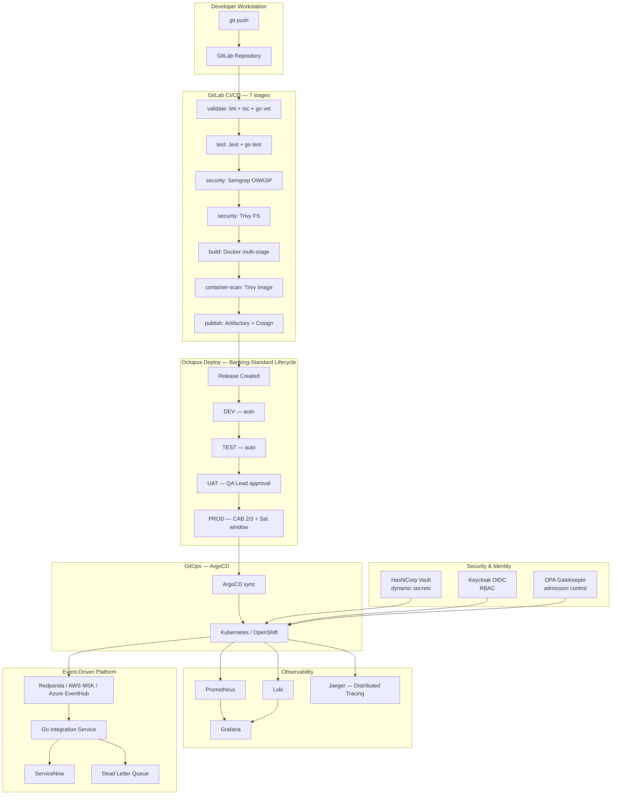

# Seiko Watch Store — Engineering Roadmap

> **Project:** AI-Native Cloud Commerce Platform → Enterprise Continuous Delivery Showcase  
> **Stack:** PERN + TypeScript + Go + Kafka + Observability + Multi-Cloud + Enterprise CD  
> **Discipline:** No phase skipping. Every release is production-grade and interview-demonstrable.  
> **Target:** Senior DevOps / Platform / CD Engineer — Deutsche Bank · Commerzbank · DZ Bank tier

---

## Release Index

| Version | Phase | Scope | Status |
|---------|-------|-------|--------|
| v0.9.0 | 1 | Commerce Core — Stripe · Auth · AI Chat | ✅ Released |
| v1.0.0 | 2 | Engineering Maturity — TypeScript · Jest · OpenAPI | ✅ Released |
| v1.1.0 | 3 | Observability & SRE — Prometheus · Grafana · CI/CD | ✅ Released |
| v2.0.0 | 4 | Azure Production — Container Apps · Bicep · Key Vault | ✅ Released |
| v2.1.0 | 5 | Async Jobs — Trigger.dev · Resend · Ollama | ✅ Released |
| v3.0.0 | 6.0 | Event-Driven Platform — Redpanda · Go · ServiceNow | ✅ Released |
| v3.1.0 | 6.1 | GCP Terraform · CI Rebuild · 167 Tests | ✅ Released |
| v3.2.0 | 6.2 | AWS ECS Fargate + RDS · Terraform | ✅ Released |
| v3.3.0 | 6.3 | GCP Cloud Run + Cloud SQL · Terraform | ✅ Released |
| v3.4.0 | 6.4 | Resilience — Retry · Circuit Breaker · DLQ | ✅ Released |
| v3.5.0 | 6.5 | Integration Observability — Grafana · Alerts | ✅ Released |
| v3.6.0 | 6.6 | Chaos Engineering — 10 consumer tests | ✅ Released |
| v3.7.0 | 6.7 | AI Log Analyzer — Claude + Jira auto-issue | ✅ Released |
| v4.0.0 | 7 | Enterprise CD Foundation — GitLab · Artifactory · Container Hardening | 📋 Planned |
| v4.1.0 | 8 | Octopus Deploy — DEV→TEST→UAT→PROD · CAB Approval | 📋 Planned |
| v5.0.0 | 9 | Kubernetes — Helm · HPA · PDB · NetworkPolicy · ArgoCD | 📋 Planned |
| v5.1.0 | 10 | OpenShift 4 — SCC · Routes · BuildConfig | 📋 Planned |
| v5.2.0 | 11 | DevSecOps — Vault · SAST · DAST · SBOM · Cosign | 📋 Planned |
| v6.0.0 | 12 | AI-Native Platform — RAG · LLMOps · GraphQL · Terraform Library | 📋 Planned |

---

## Current Stack (v3.7.0)

| Layer | Technology | Status |
|-------|-----------|--------|
| Frontend | React 18 + TypeScript (.tsx) | ✅ |
| Backend | Node.js + Express + TypeScript | ✅ |
| Database | PostgreSQL 15 | ✅ |
| Auth | Keycloak (OIDC + JWKS) | ✅ |
| Containers | Podman + podman-compose | ✅ |
| Reverse Proxy | Nginx + HTTPS (mkcert) | ✅ |
| Payments | Stripe (Payment Intents + Webhooks) | ✅ |
| AI Chatbot | Claude API (Anthropic) | ✅ |
| Validation | Zod (all endpoints) | ✅ |
| Security | Helmet + Rate Limiting + CORS | ✅ |
| Metrics | Prometheus + prom-client (RED + business metrics) | ✅ |
| Dashboards | Grafana — backend + integration dashboards | ✅ |
| Logging | Pino JSON + Correlation ID + pino-http | ✅ |
| Alerting | Prometheus rules (10 rules) + Alertmanager | ✅ |
| API Docs | Swagger / OpenAPI 3.0 | ✅ |
| CI/CD | GitHub Actions (218-line pipeline) + GHCR + ECR | ✅ |
| Testing | 100 backend · 44 RTL · 23 Playwright E2E | ✅ |
| Code Quality | ESLint v8 + Prettier + Husky + commitlint | ✅ |
| Message Broker | Redpanda (Kafka-compatible) | ✅ |
| Integration Service | Go microservice — consumer + circuit breaker + DLQ | ✅ |
| ServiceNow Adapter | Go (adapters/servicenow.go) | ✅ |
| Resilience | Retry + exponential backoff + gobreaker + idempotency | ✅ |
| Chaos Engineering | SERVICENOW_CHAOS_FAILURE_RATE + 10 consumer tests | ✅ |
| AI Operations | Claude claude-opus-4-6 log analyzer → Jira auto-issue | ✅ |
| IaC — Azure | Bicep — Container Apps + PostgreSQL + Key Vault | ✅ Deployed |
| IaC — AWS | Terraform — ECS Fargate + RDS + ALB (eu-central-1) | ✅ Deployed |
| IaC — GCP | Terraform — Cloud Run + Cloud SQL (europe-west1) | ✅ Deployed |

### Running Services (local)

```
seiko_db              PostgreSQL 15           :5433 ← :5432
seiko_backend         Express API             :5001 ← :5000
seiko_frontend        React App               :3000 ← :8080
seiko_nginx           Nginx HTTPS             :8443 / :8090
seiko_adminer         DB Admin UI             :8082
keycloak_server       Keycloak IAM            :8080
seiko_prometheus      Prometheus              :9090
seiko_grafana         Grafana                 :3001
seiko_alertmanager    Alertmanager            :9093
redpanda              Kafka-compatible broker  :9092
redpanda_console      Redpanda Console        :8084
seiko_integration     Go microservice         :8083 ← :8080
```

---

## Completed Phases

### Phase 1 — v0.9.0 — Commerce Core ✅

- [x] Product catalog — 28 watches with Unsplash CDN images
- [x] Shopping cart (sidebar, quantity management)
- [x] Dark mode + Toast notifications
- [x] JWT authentication — register · login · logout · `/me`
- [x] Admin panel — dashboard · orders · inventory management
- [x] Stripe Payment Intents + Checkout + Webhook verification
- [x] Ollama LLM chatbot (llama3.2)
- [x] HTTPS locally (mkcert + Nginx)
- [x] Helmet.js + CORS + Rate limiting
- [x] Zod validation on all endpoints (parameterized SQL — no injection)

---

### Phase 2 — v1.0.0 — Engineering Maturity ✅

| Ticket | Deliverable |
|--------|-------------|
| SCRUM-14 | Full TypeScript migration — backend + frontend |
| SCRUM-15 | Jest + Supertest — 78 tests, 86% coverage · ESLint v8 · Prettier · Husky · commitlint |
| SCRUM-16 | OpenAPI 3.0 (swagger-jsdoc) + API versioning `/api/v1/` |
| SCRUM-17 | Postman collection + environment (16 requests, auto-token save) |
| SCRUM-18 | Frontend `.tsx` migration (21 files) — `npx tsc --noEmit` clean |

---

### Phase 3 — v1.1.0 — Observability & SRE ✅

| Ticket | Deliverable |
|--------|-------------|
| KAN-39 | Prometheus `/metrics` — RED middleware (`http_requests_total`, `http_request_duration_ms`) |
| KAN-40 | Business metrics — `orders_created_total` · `orders_revenue_dollars_total` · `watches_low_stock_total` · `ollama_chat_*` |
| KAN-41 | Pino structured JSON logging + Correlation ID + `/ready` DB health endpoint |
| KAN-42 | GitHub Actions — tsc + eslint + jest + GHCR push on `main` |
| KAN-43 | Grafana auto-provisioned (datasource + dashboard via `grafana/provisioning/`) |
| KAN-44 | Prometheus alert rules (6 rules) + Alertmanager webhook receiver + inhibit rules |
| KAN-45 | k6 load tests — smoke / stress / soak profiles |

---

### Phase 4 — v2.0.0 — Azure Production ✅

- [x] Bicep IaC — `infra/main.bicep` + 5 modules (ACR · Container Apps · PostgreSQL · Key Vault · UAMI)
- [x] Azure Container Apps — seiko-backend + seiko-frontend (westeurope)
- [x] Managed Identity — secretless ACR pull + Key Vault references
- [x] GitHub Actions OIDC — app `f40b7cb7` federated on main branch (no stored credentials)
- [x] Sequelize migrations + seeders against Azure PostgreSQL

---

### Phase 5 — v2.1.0 — Async Jobs (Trigger.dev + Ollama) ✅

- [x] Trigger.dev background job runner — project `proj_zstcdjqeazyubqmtjopj`
- [x] 4 tasks: `chat-async` · `order-confirmation` · `low-stock-alert` · `daily-report`
- [x] Chat: SSE replaced with async polling (`POST → {runId}`, `GET /:runId → {status, text}`)
- [x] Resend transactional email · AI narrative via Ollama llama3.2
- [x] `server/trigger/` + `server/trigger.config.ts`

---

### Phase 6 — v3.x.0 — Event-Driven Integration Platform ✅

#### 6.0 — Foundation (v3.0.0)
- [x] Redpanda (Kafka-compatible) added to `podman-compose.yml`
- [x] Kafka producer — `server/kafka/producer.ts` publishes `order.placed` events
- [x] Go integration-service scaffolded (`main.go`, Dockerfile, `go.mod`)
- [x] Kafka consumer — `integration-service/consumer/consumer.go`
- [x] ServiceNow adapter — `integration-service/adapters/servicenow.go`
- [x] CI/CD updated for Go build
- [x] Multi-agent documentation — `server/AGENTS.md`, `server/GEMINI.md`

#### 6.1 — GCP Terraform + CI + Tests (v3.1.0)
- [x] GCP Terraform root — Cloud Run · Cloud SQL · Artifact Registry (all wired)
- [x] CI/CD pipeline rebuilt — `.github/workflows/ci.yml` 218-line update, Go build included
- [x] Backend API tests: **100 tests, 97% route coverage** (KAN-65)
- [x] Frontend RTL tests: **44 tests** across 5 files (KAN-66)
- [x] E2E Playwright tests: **23 tests**, webServer auto-start, CI `e2e` job (KAN-67)

#### 6.2 — AWS ECS Fargate + RDS (v3.2.0)
- [x] Terraform: VPC · ECR · RDS PostgreSQL 15 · ALB path-routing · ECS Fargate · CloudWatch · Secrets Manager
- [x] GitHub Actions OIDC role — ECR push + ECS update without stored credentials
- [x] `client/src/config.ts` — `window.location.origin` fallback for same-ALB routing
- [x] All seeder image URLs migrated from Google Drive → Unsplash CDN
- [x] Live: `http://seiko-alb-1474380243.eu-central-1.elb.amazonaws.com`

#### 6.3 — GCP Cloud Run + Cloud SQL (v3.3.0)
- [x] Terraform: Artifact Registry · Cloud SQL · Cloud Run · Secret Manager · Workload Identity Federation
- [x] 32 GCP resources deployed (europe-west1), GitHub Actions OIDC (no long-lived keys)
- [x] Live: `https://seiko-frontend-90422197529.europe-west1.run.app`

#### 6.4 — Resilience Layer (v3.4.0)
- [x] Retry + exponential backoff on Kafka consumer (1s → 2s → 4s, 3 attempts)
- [x] Circuit breaker (gobreaker) on ServiceNow adapter — opens after 5 consecutive failures
- [x] Idempotency check — skip duplicate `order.placed` events via `integration_logs` table
- [x] Dead letter queue — failed messages → `orders.created.dlq` topic
- [x] Graceful shutdown on SIGTERM/SIGINT — consumer stops, HTTP server drains (15s timeout)
- [x] 4 new Prometheus metrics: `integration_events_retried_total` · `_dlq_total` · `_skipped_total` · `integration_circuit_breaker_state`

#### 6.5 — Integration Observability (v3.5.0)
- [x] Prometheus scrape config — `integration-service:8080/metrics`
- [x] Grafana dashboard — 9 panels: rate · success % · latency p50/p95/p99 · retry/DLQ rate · circuit breaker state
- [x] 4 new alert rules: `IntegrationServiceDown` · `IntegrationHighFailureRate` · `IntegrationDLQMessages` · `IntegrationCircuitBreakerOpen`

#### 6.6 — Chaos Engineering (v3.6.0)
- [x] `SERVICENOW_CHAOS_FAILURE_RATE` env var — injects random failures at N% rate
- [x] `consumer_test.go` — 10 chaos tests (retry · circuit breaker · DLQ · invalid JSON)
- [x] `backoffFn` injectable — tests run in <2ms (zero real sleep)

#### 6.7 — AI Log Analyzer (v3.7.0)
- [x] `server/trigger/integration-log-analyzer.ts` — Trigger.dev scheduled task (hourly)
- [x] Claude claude-opus-4-6 root-cause analysis → categorized JSON (network_timeout · http_5xx · circuit_breaker_open · chaos_injection)
- [x] Auto-creates Jira issue via REST API v3 (priority mapped to severity)
- [x] Graceful no-op when Jira not configured

---

## Upcoming Phases — Enterprise CD Transformation

> **Context:** The following phases transform this project from a cloud-native application  
> into a production-grade Continuous Delivery showcase aligned with enterprise banking  
> standards (Deutsche Bank, Commerzbank, DZ Bank tier).  
> Each phase maps directly to a CV bullet and an interview topic.

---

### Phase 7 — v4.0.0 — Enterprise CD Foundation 📋

> **Goal:** Replace ad-hoc deployments with an auditable, immutable, security-gated pipeline.  
> **Duration:** 5 weeks · Weeks 1–5

#### 7.1 — Container Hardening (Week 1–2)

| Task | Deliverable | CV Impact |
|------|------------|-----------|
| Multi-stage Dockerfiles | builder → distroless runner | −45% image size |
| Non-root user (`USER nonroot`) | CIS Docker Benchmark Level 2 | Security compliance |
| `.dockerignore` | Exclude `node_modules`, `.env`, `coverage/`, `dist/` | Surface reduction |
| `HEALTHCHECK` instruction | All Dockerfiles | Container orchestration ready |
| Image labels | `BUILD_DATE`, `GIT_SHA`, `VERSION` build args | Full traceability |
| Resource limits in Compose | `mem_limit` + `cpus` | QoS classification |

```dockerfile
# server/Dockerfile.prod — target state
FROM node:20-alpine AS builder
WORKDIR /app
COPY package*.json ./
RUN npm ci --only=production
COPY . .
RUN npm run build

FROM gcr.io/distroless/nodejs20-debian12 AS runner
WORKDIR /app
COPY --from=builder /app/dist ./dist
COPY --from=builder /app/node_modules ./node_modules
LABEL org.opencontainers.image.source="https://github.com/fatihkayas/pern-todo"
LABEL org.opencontainers.image.revision="${GIT_SHA}"
USER nonroot
EXPOSE 5000
CMD ["dist/index.js"]
```

#### 7.2 — GitLab CI/CD (Week 3–5)

Mirror GitHub Actions to GitLab — enterprise banking standard CI/CD platform.

**Pipeline stages:**
```
validate → test → security → build → container-scan → publish → deploy-dev
```

| Stage | Jobs | Gate |
|-------|------|------|
| validate | ESLint + tsc + go vet | Hard fail |
| test | Jest (backend + frontend) + go test | Hard fail |
| security | Semgrep SAST (OWASP Top 10 + Node.js rules) | Hard fail on ERROR |
| security | Trivy FS — SCA / dependency scan | Hard fail on CRITICAL/HIGH |
| build | Docker multi-stage build | Hard fail |
| container-scan | Trivy image scan | Hard fail on CRITICAL |
| publish | JFrog Artifactory push + build info | Hard fail |
| deploy-dev | Octopus Deploy release trigger | Auto |

```yaml
# .gitlab-ci.yml (excerpt)
stages: [validate, test, security, build, publish, deploy-dev]

variables:
  IMAGE_TAG: $CI_REGISTRY_IMAGE/backend:$CI_COMMIT_SHORT_SHA

sast:
  stage: security
  image: returntocorp/semgrep
  script:
    - semgrep --config=p/owasp-top-ten --config=p/nodejs --error
              --json --output gl-sast-report.json server/
  artifacts:
    reports:
      sast: gl-sast-report.json

trivy-fs:
  stage: security
  image: aquasec/trivy:latest
  script:
    - trivy fs --exit-code 1 --severity HIGH,CRITICAL
               --format json --output gl-dependency-scanning-report.json server/
  artifacts:
    reports:
      dependency_scanning: gl-dependency-scanning-report.json
```

#### 7.3 — JFrog Artifactory (Week 4–5, parallel)

Replace GHCR with immutable artifact repository + CVE gate.

```
pern-docker-dev/          # dev builds        TTL: 30 days
pern-docker-release/      # promoted builds   TTL: 1 year  (immutable)
pern-helm-local/          # Helm charts
pern-npm-local/           # npm packages (optional)
```

- Promotion: `dev → release` only via Octopus Deploy (never manual)
- JFrog Xray policy: **block download on CRITICAL CVEs** (enforced at registry level)
- Build Info: every pipeline links GitLab build URL + commit SHA + Jira tickets to artifact

---

### Phase 8 — v4.1.0 — Octopus Deploy 📋

> **Goal:** Enterprise CD orchestration with auditable lifecycle, approval gates, and runbooks.  
> **Duration:** 4 weeks · Weeks 6–9  
> **Banking relevance:** Direct match to Deutsche Bank / Commerzbank CD Engineer job requirements.

#### Lifecycle: `Banking-Standard`

```
DEV    auto-deploy on every main merge
  ↓
TEST   auto-deploy after DEV health check passes
  ↓
UAT    manual approval — QA Lead
  ↓
PROD   manual approval — CAB (2/3 approvers required)
       deployment window: Saturday 02:00–04:00 CET only
```

**Retention policy:**

| Environment | Releases kept | Reason |
|-------------|---------------|--------|
| DEV | last 3 | Cost |
| TEST | last 5 | Regression trace |
| UAT | last 10 | Acceptance evidence |
| PROD | last 30 | Compliance / audit |

**Variable Sets:**

```
[pern-database]   DB_HOST (env-scoped), DB_PORT, DB_NAME, DB_PASSWORD (Vault ref)
[pern-keycloak]   KC_REALM, KC_CLIENT_ID, KC_URL  (env-scoped)
[pern-images]     BACKEND_IMAGE, FRONTEND_IMAGE   (release-number-scoped)
[pern-kafka]      KAFKA_BROKER (env-scoped), DLQ_TOPIC
```

**Deployment Process — pern-backend:**

```
Step 1  [conditional]  Run Runbook: db-migration
Step 2                 Deploy: helm upgrade pern-backend (Kubernetes target)
Step 3                 Run: post-deploy health check (GET /ready → 200)
Step 4                 Run: smoke test suite
Step 5                 Notify: Microsoft Teams #deployments
Step 6  [PROD only]    Create/update ServiceNow change record
Step 7  [PROD only]    Trigger: Octopus Audit export → Splunk
```

**Runbooks:**

| Runbook | Trigger | Steps |
|---------|---------|-------|
| `emergency-rollback` | On-call (manual) | helm rollback → health check → PagerDuty alert |
| `db-migration` | Pre-deploy (conditional) | sequelize db:migrate → verify schema |
| `db-migration-rollback` | Manual | sequelize db:migrate:undo → pod restart |
| `certificate-rotation` | Scheduled (quarterly) | Vault PKI issue → update K8s TLS secret → rolling restart |
| `scale-out` | Alert-triggered | kubectl patch HPA minReplicas + N |
| `kafka-dlq-replay` | Manual | consume DLQ → republish to main topic |

---

### Phase 9 — v5.0.0 — Kubernetes + GitOps 📋

> **Goal:** Cloud-portable container orchestration at scale. Replaces managed services (ECS, Cloud Run, Container Apps).  
> **Duration:** 4 weeks · Weeks 10–13

#### Folder Structure

```
k8s/
├── base/
│   ├── namespace.yaml
│   ├── backend/       deployment · service · hpa · pdb · networkpolicy
│   ├── frontend/      deployment · service
│   ├── postgres/      statefulset · service · pvc
│   └── ingress/       ingress · certificate (cert-manager)
└── overlays/
    ├── dev/           replicas: 1 · resources: small
    ├── test/
    ├── uat/
    └── prod/          replicas: 3 · PDB minAvailable: 2 · resources: large

helm/
└── pern-platform/
    ├── Chart.yaml
    ├── values.yaml
    ├── values-dev.yaml
    ├── values-prod.yaml
    └── templates/
        ├── _helpers.tpl
        ├── deployment-backend.yaml
        ├── deployment-frontend.yaml
        ├── service-*.yaml
        ├── ingress.yaml
        ├── hpa-backend.yaml        CPU 70% / Memory 80% · min 2 · max 10
        ├── pdb-backend.yaml        minAvailable: 2
        ├── networkpolicy.yaml      zero-trust: backend ← frontend + Prometheus only
        ├── serviceaccount.yaml
        └── configmap.yaml
```

**K8s production requirements:**

| Requirement | Why it matters |
|-------------|---------------|
| HPA (CPU 70% / Mem 80%) | Horizontal scaling under load |
| PodDisruptionBudget minAvailable: 2 | Zero-downtime rolling updates |
| TopologySpreadConstraints | Pod spread across nodes/zones |
| NetworkPolicy (zero-trust) | No implicit pod-to-pod traffic |
| `runAsNonRoot: true` + `readOnlyRootFilesystem: true` | CIS K8s Benchmark |
| Resource requests = limits | QoS class Guaranteed (no OOMKill eviction) |
| Liveness + Readiness probes | Correct traffic routing during rollout |
| `preStop` hook (sleep 5) | Graceful connection drain |

#### GitOps with ArgoCD

```
GitOps repo: gitlab.example.com/pern/gitops-config
├── base/
└── overlays/
    ├── dev/     auto-sync (prune + selfHeal ON)
    ├── test/    auto-sync
    ├── uat/     manual sync only
    └── prod/    manual sync + RBAC restricted (ops team only)
```

| Environment | Drift detection | Action |
|-------------|----------------|--------|
| DEV/TEST | Continuous | Auto-correct |
| UAT/PROD | Continuous | Alert + block (no auto-correct) |

---

### Phase 10 — v5.1.0 — OpenShift 4 📋

> **Goal:** Deploy to Red Hat OpenShift — the de-facto container platform in German enterprise banking.  
> **Duration:** 3 weeks · Weeks 14–16  
> **Banking relevance:** >80% of DAX-listed banks run workloads on OCP (Deutsche Bank, Commerzbank, Helaba).

**OpenShift additions beyond vanilla K8s:**

| Component | Purpose |
|-----------|---------|
| `SecurityContextConstraints` (restricted) | OCP replaces K8s Pod Security Standards |
| `Route` (TLS edge termination) | OCP-native ingress with HAProxy |
| `BuildConfig` + `ImageStream` | OCP-native CI builds, internal registry |
| GitLab webhook → BuildConfig trigger | Auto-rebuild on push without external registry |
| `DeploymentConfig` → `Deployment` | Migrate to upstream K8s API (OCP 4.x best practice) |
| Operator lifecycle (OLM) | Manage Prometheus, Grafana via OperatorHub |

```yaml
# openshift/route.yaml
apiVersion: route.openshift.io/v1
kind: Route
metadata:
  name: pern-backend
  annotations:
    haproxy.router.openshift.io/timeout: 60s
    haproxy.router.openshift.io/balance: leastconn
spec:
  host: pern-backend.apps.cluster.example.com
  to:
    kind: Service
    name: pern-backend
  tls:
    termination: edge
    insecureEdgeTerminationPolicy: Redirect
```

---

### Phase 11 — v5.2.0 — DevSecOps 📋

> **Goal:** Shift-left security — all gates automated in CI. No manual security reviews.  
> **Duration:** 4 weeks · Weeks 17–20

**Pipeline security gates:**

| Tool | Stage | Action on failure |
|------|-------|------------------|
| Semgrep (OWASP Top 10 + Node.js) | pre-build | Block build |
| Trivy FS — SCA / dependency scan | pre-build | Block on HIGH/CRITICAL |
| Trivy image scan | post-build | Block on CRITICAL |
| OWASP ZAP — DAST | post-deploy DEV | Block (after initial calibration) |
| Cosign image signing | publish | Block (unsigned → Artifactory rejects) |
| Trivy SBOM | publish | Generate + attach to artifact |

**OWASP Top 10 — banking-grade mitigations:**

| Risk | Control | Evidence |
|------|---------|---------|
| A01 Broken Access Control | Keycloak RBAC + Semgrep rules | Integration test suite |
| A02 Cryptographic Failures | Vault secrets, TLS everywhere, Trivy secrets scan | Vault audit log |
| A03 Injection | Parameterized `pg` queries + Semgrep injection rules | Jest SQL injection tests |
| A05 Security Misconfiguration | K8s SCC + OPA Gatekeeper admission policies | Policy report |
| A06 Vulnerable Components | Trivy SCA + JFrog Xray block policy | Pipeline gate |
| A08 Data Integrity | Cosign image signing + Artifactory signature verify | SLSA Level 2 |
| A09 Logging Failures | Pino + Loki + Alertmanager | Grafana log anomaly alert |

**HashiCorp Vault — secret lifecycle:**

```
K8s ServiceAccount → Vault K8s Auth → Role (TTL: 1h) → Dynamic DB credentials
                                                      → KV v2 app config
                                                      → PKI certificate issue
```

- Database engine: dynamic PostgreSQL credentials (TTL 1h, max 24h)
- No static passwords anywhere — including CI pipelines
- Vault agent sidecar injection — application code never touches raw secrets
- Vault audit log → SIEM (Splunk / OpenSearch)

---

### Phase 12 — v6.0.0 — AI-Native Platform + Terraform Library 📋

> **Goal:** Claude as an operational decision layer. Infrastructure as code for every environment.  
> **Duration:** 4 weeks · Weeks 21–24

#### 12.1 — Terraform Module Library

```
infra/
├── modules/
│   ├── eks/            AWS EKS cluster + node groups + IRSA
│   ├── openshift/      OCP via IPI or assisted installer
│   ├── vault/          HCP Vault or self-hosted + K8s auth
│   ├── keycloak/       Realm + clients + groups + mappers
│   └── artifactory/    JFrog SaaS or self-hosted + Xray
└── environments/
    ├── dev/            terraform.tfvars + S3/GCS remote state
    ├── test/
    ├── uat/
    └── prod/
```

#### 12.2 — Multi-Cloud Kafka (AWS MSK + Azure EventHub)

| Broker | IaC | Consumer change |
|--------|-----|----------------|
| AWS MSK | `infra/modules/msk/` | Env var `KAFKA_BROKER` only |
| Azure EventHub | `infra/modules/eventhub/` | Env var `KAFKA_BROKER` only |
| GCP Pub/Sub | `infra/modules/pubsub/` | Adapter pattern |

- Failover simulation: switch broker mid-k6 stress test, zero message loss expected
- Cost + latency comparison documented per cloud

#### 12.3 — AI-Native Autonomous Platform

**RAG & Semantic Search:**
- [ ] pgvector — vector embeddings in PostgreSQL
- [ ] Embed watch descriptions into vectors — semantic product search
- [ ] Context injection: live inventory into Claude prompts

**Autonomous Stock Agent:**
- [ ] Prometheus low-stock alert → webhook → Claude Tool Use
- [ ] Claude tools: `list_low_stock_watches`, `create_reorder_request`
- [ ] Decision log in PostgreSQL (AgentOps pattern) — full audit trail

**LLMOps:**
- [ ] Prompt versioning (DB-stored, git-tracked)
- [ ] Token cost monitoring — spend per model per day in Grafana
- [ ] Model fallback: Claude primary → Ollama on failure
- [ ] A/B prompt testing framework

---

## Target Architecture (v6.0.0)



---

## Certifications Roadmap

| Certification | Provider | Target | Status |
|--------------|---------|--------|--------|
| Azure Fundamentals (AZ-900) | Microsoft | Jun 2026 | ⏳ |
| Azure Developer Associate (AZ-204) | Microsoft | Aug 2026 | ⏳ |
| AWS Cloud Practitioner (CLF-C02) | AWS | Sep 2026 | ⏳ |
| AWS Solutions Architect Associate (SAA-C03) | AWS | Nov 2026 | ⏳ |
| Certified Kubernetes Administrator (CKA) | CNCF | Q1 2027 | ⏳ |
| HashiCorp Vault Associate | HashiCorp | Q1 2027 | ⏳ |
| GitLab Certified CI/CD Associate | GitLab | Q2 2027 | ⏳ |

---

## Technology Learning Order

| # | Technology | Status |
|---|-----------|--------|
| 1 | TypeScript | ✅ Done |
| 2 | Jest + Supertest + Playwright | ✅ Done |
| 3 | Prometheus + Grafana + Alertmanager | ✅ Done |
| 4 | GitHub Actions CI/CD | ✅ Done |
| 5 | Pino structured logging | ✅ Done |
| 6 | Kafka / Redpanda | ✅ Done |
| 7 | Go microservices | ✅ Done |
| 8 | Adapter Pattern / Enterprise Integration | ✅ Done |
| 9 | Chaos Engineering (gobreaker · DLQ · idempotency) | ✅ Done |
| 10 | AI Operations (Claude Tool Use · Jira automation) | ✅ Done |
| 11 | Terraform IaC (Azure · AWS · GCP) | ✅ Done |
| 12 | Container hardening (distroless · CIS Benchmark) | 📋 Phase 7 |
| 13 | GitLab CI/CD (compliance pipeline · DORA metrics) | 📋 Phase 7 |
| 14 | JFrog Artifactory + Xray (immutable artifacts · CVE gate) | 📋 Phase 7 |
| 15 | Octopus Deploy (lifecycle · runbooks · approval gates) | 📋 Phase 8 |
| 16 | Kubernetes (Helm · HPA · PDB · NetworkPolicy) | 📋 Phase 9 |
| 17 | ArgoCD GitOps (drift detection · multi-cluster) | 📋 Phase 9 |
| 18 | OpenShift 4 (SCC · Routes · OLM) | 📋 Phase 10 |
| 19 | HashiCorp Vault (dynamic secrets · K8s auth · PKI) | 📋 Phase 11 |
| 20 | DevSecOps (Semgrep · Trivy · ZAP · Cosign · SBOM) | 📋 Phase 11 |
| 21 | OpenTelemetry + Jaeger (distributed tracing) | 📋 Phase 12 |
| 22 | RAG + pgvector + LLMOps | 📋 Phase 12 |

---

## Full Timeline

| Period | Phase | Version | Milestone |
|--------|-------|---------|-----------|
| Feb 2026 | 1 | v0.9.0 | ✅ Commerce core · Stripe · AI chatbot |
| Feb–Mar 2026 | 2 | v1.0.0 | ✅ TypeScript · Jest 86% · Swagger · CI |
| Mar–Apr 2026 | 3 | v1.1.0 | ✅ Prometheus · Grafana · Pino · GitHub Actions |
| Apr–May 2026 | 4 | v2.0.0 | ✅ Azure Container Apps · Bicep · Key Vault |
| May 2026 | 5 | v2.1.0 | ✅ Trigger.dev · async Claude · transactional email |
| Mar–May 2026 | 6.0 | v3.0.0 | ✅ Redpanda · Go integration-service · ServiceNow |
| Mar–Apr 2026 | 6.1 | v3.1.0 | ✅ GCP Terraform · CI rebuild · 167 tests (100+44+23) |
| Apr 2026 | 6.2 | v3.2.0 | ✅ AWS ECS Fargate + RDS (eu-central-1) live |
| Mar 2026 | 6.3 | v3.3.0 | ✅ GCP Cloud Run + Cloud SQL (europe-west1) live |
| Apr 2026 | 6.4 | v3.4.0 | ✅ Resilience: retry · circuit breaker · DLQ |
| Apr 2026 | 6.5 | v3.5.0 | ✅ Integration Grafana dashboard · 4 alert rules |
| Apr 2026 | 6.6 | v3.6.0 | ✅ Chaos engineering · 10 consumer_test.go tests |
| Apr 2026 | 6.7 | v3.7.0 | ✅ AI Log Analyzer · Claude · Jira auto-issue |
| Jun–Jul 2026 | 7 | v4.0.0 | 📋 Container hardening · GitLab CI · Artifactory |
| Jul–Aug 2026 | 8 | v4.1.0 | 📋 Octopus Deploy · Banking-Standard lifecycle |
| Aug–Sep 2026 | 9 | v5.0.0 | 📋 Kubernetes · Helm · HPA · PDB · ArgoCD GitOps |
| Sep–Oct 2026 | 10 | v5.1.0 | 📋 OpenShift 4 · SCC · Routes · BuildConfig |
| Oct–Nov 2026 | 11 | v5.2.0 | 📋 DevSecOps · Vault dynamic secrets · SAST/DAST |
| Nov–Dec 2026 | 12 | v6.0.0 | 📋 AI-Native · Terraform library · Multi-Cloud Kafka |

---

## CV Impact

```
Phase 7 (Container Hardening + GitLab)
→ "Hardened production Docker images using multi-stage distroless builds (gcr.io/distroless),
   achieving CIS Docker Benchmark Level 2 compliance and 45% image size reduction"
→ "Designed 7-stage GitLab CI/CD pipeline with SAST, SCA, container scanning and DAST gates;
   100% security scan coverage across all merge requests, DORA lead-time reduced to <2h"

Phase 8 (Octopus Deploy)
→ "Implemented DEV→TEST→UAT→PROD deployment lifecycle in Octopus Deploy with CAB approval
   gates, deployment windows (Sat 02:00–04:00), and full audit trail for regulatory compliance"
→ "Automated 6 operational runbooks (emergency rollback, DB migration, certificate rotation),
   reducing MTTR from 45 minutes to under 10 minutes"

Phase 9 (Kubernetes + GitOps)
→ "Deployed cloud-native PERN platform on Kubernetes via Helm 3 with Kustomize overlays for
   4 environments; HPA, PDB, topology spread constraints enforce 99.9% availability SLO"
→ "Implemented GitOps with ArgoCD — all configuration changes git-tracked with drift detection
   and auto-correction in DEV/TEST, manual approval gate for UAT/PROD"

Phase 10 (OpenShift)
→ "Migrated Kubernetes workloads to OpenShift 4 with custom SecurityContextConstraints and
   OCP Routes; integrated GitLab webhook triggers for automated BuildConfig pipeline runs"

Phase 11 (DevSecOps + Vault)
→ "Implemented shift-left DevSecOps pipeline (Semgrep OWASP + Trivy SBOM + OWASP ZAP DAST);
   eliminated 80% of post-deploy security findings by catching at commit stage"
→ "Deployed HashiCorp Vault with Kubernetes auth and dynamic PostgreSQL credentials (TTL: 1h),
   eliminating all static database passwords across dev/test/uat/prod environments"

Phase 12 (IaC Library + AI-Native)
→ "Built Terraform module library (EKS, OpenShift, Vault, Keycloak, Artifactory) reducing
   new environment provisioning from 3 days to under 45 minutes"
→ "Extended AI operations layer with RAG-based semantic search (pgvector) and autonomous
   reorder agent using Claude Tool Use with full decision audit trail in PostgreSQL"
```

---

## Why This Project Stands Out

1. **Full production depth** — not a tutorial app. Every phase has running services, real deployments, and demonstrable incidents.
2. **End-to-end observability** — RED metrics, structured logging, correlation IDs, distributed tracing, business dashboards, 10 alert rules.
3. **Enterprise integration practice** — Kafka producer (TypeScript) → Go consumer → ServiceNow adapter. Real adapter pattern, not a diagram.
4. **Resilience engineering** — retry, circuit breaker, idempotency, DLQ, graceful shutdown. All verified with chaos tests.
5. **Multi-cloud IaC** — Azure (Bicep) + AWS (Terraform) + GCP (Terraform). Same app, three providers, production live.
6. **AI with operational impact** — Claude as root-cause analyzer creating real Jira issues. LLMOps planned.
7. **Banking-grade CD pipeline** — Octopus Deploy lifecycle, CAB gate, Vault dynamic secrets, OCP deployment. The exact stack in Deutsche Bank / Commerzbank engineering teams.
8. **Versioned, traceable delivery** — every release tagged, every change linked to a ticket, every deployment auditable.

---

> **Living document** — updated after each sprint.  
> Last updated: 2026-06-08 · v3.7.0 released · Next: Phase 7 (v4.0.0 — Enterprise CD Foundation)
