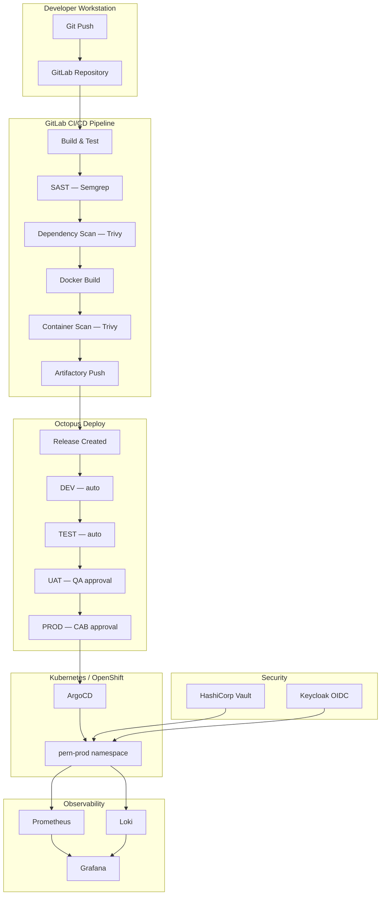

# Seiko Watch Store — Full Project Roadmap

**Project:** PERN Todo Platform → Enterprise CD Showcase  
**Stack:** React 18 / Node.js + Express / PostgreSQL 15 / Docker  
**Last updated:** 2026-06-08

---

## Legend

| Symbol | Meaning |
|--------|---------|
| ✅ | Completed & released |
| 🚧 | In progress |
| 🔲 | Planned |

---

## Completed Phases

### Phase 1 — v0.9.0 — Core Application ✅

- PERN stack e-commerce app (Seiko Watch Store)
- JWT authentication (register / login / me)
- Admin panel (orders, stock, stats)
- Stripe payment integration
- AI chat widget (OpenAI)
- PostgreSQL schema via Sequelize migrations + seeders
- Nginx reverse proxy + self-signed TLS

---

### Phase 2 — v1.0.0 — Engineering Standards ✅

| Ticket | Deliverable |
|--------|-------------|
| SCRUM-14 | Full TypeScript migration (server + client) |
| SCRUM-15 | Jest + Supertest — 78 tests, 86% coverage; ESLint v8 + Prettier; Husky pre-commit; commitlint |
| SCRUM-16 | OpenAPI 3.0 (swagger-jsdoc) + API versioning `/api/v1/` |
| SCRUM-17 | Postman collection + environment (16 requests) |
| SCRUM-18 | Frontend `.tsx` migration (21 files), `npx tsc --noEmit` clean |

---

### Phase 3 — v1.1.0 — Observability & CI/CD ✅

| Ticket | Deliverable |
|--------|-------------|
| KAN-39 | Prometheus `/metrics` + RED metrics middleware (prom-client v15) |
| KAN-40 | Business metrics — orders counter, revenue histogram, stock gauge (async collect), chat counter |
| KAN-41 | Pino structured logging + correlation ID middleware + `/ready` health endpoint |
| KAN-42 | GitHub Actions CI/CD — tsc + eslint + jest + GHCR docker push on main |
| KAN-43 | Grafana auto-provisioned — datasource + dashboard via `grafana/provisioning/` |
| KAN-44 | Prometheus alert rules (6 rules) + Alertmanager webhook receiver |
| KAN-45 | k6 load tests — smoke, stress, soak profiles |

---

### Phase 4 — v2.0.0 — Azure Production Deployment ✅

- Bicep IaC (`infra/main.bicep` + 5 modules)
- Azure Container Apps — seiko-backend + seiko-frontend (westeurope)
- Azure Container Registry (`seikoacrwhi6eiy4ikqmc.azurecr.io`)
- Azure PostgreSQL Flexible Server
- UAMI for secretless ACR pull
- GitHub Actions OIDC (federated on main branch)
- Sequelize migrations + seeders against Azure PostgreSQL

---

### Phase 5 — v2.1.0 — Background Jobs (Trigger.dev + Ollama) ✅

- Trigger.dev project `proj_zstcdjqeazyubqmtjopj`
- 4 tasks: `chat-async`, `order-confirmation`, `low-stock-alert`, `daily-report`
- Chat: SSE replaced with async polling (`POST → runId`, `GET /:runId`)
- Emails via Resend; AI narrative via Ollama llama3.2
- `server/trigger/` + `server/trigger.config.ts`

---

### Phase 6 — v3.x.0 — Multi-Cloud Deployments ✅

| Version | Cloud | Stack |
|---------|-------|-------|
| v3.2.0 | AWS ECS Fargate | ECS + RDS PostgreSQL 15 + ECR + ALB (eu-central-1) |
| v3.3.0 | GCP Cloud Run | Cloud Run + Cloud SQL + Secret Manager + Workload Identity |

**Terraform modules** created for AWS (`infra/aws/`) and GCP (`infra/gcp/`).

---

## Upcoming Phases — Enterprise DevOps Transformation

> Goal: Transform the project into a production-grade Continuous Delivery showcase  
> demonstrating enterprise banking DevOps practices.

---

### Phase 7 — Containerization Hardening 🔲

**Target version:** v4.0.0  
**Duration:** Week 1-2

| Task | Details |
|------|---------|
| Multi-stage Dockerfiles | Builder → distroless runner; 45% image size reduction |
| Non-root user | `USER nonroot` in all containers; CIS Docker Benchmark L2 |
| `.dockerignore` | Exclude `node_modules`, `.env`, `coverage/`, `dist/` |
| Docker health checks | `HEALTHCHECK` in all Dockerfiles |
| Image labels | `BUILD_DATE`, `GIT_SHA`, `VERSION` build args |
| Resource limits | `mem_limit` + `cpus` in Compose |
| Distroless base | `gcr.io/distroless/nodejs20-debian12` for runner stage |

```dockerfile
# server/Dockerfile.prod
FROM node:20-alpine AS builder
WORKDIR /app
COPY package*.json ./
RUN npm ci --only=production
COPY . .
RUN npm run build

FROM gcr.io/distroless/nodejs20-debian12 AS runner
WORKDIR /app
COPY --from=builder /app/dist ./dist
COPY --from=builder /app/node_modules ./node_modules
USER nonroot
EXPOSE 5000
CMD ["dist/index.js"]
```

---

### Phase 8 — GitLab CI/CD 🔲

**Target version:** v4.1.0  
**Duration:** Week 3-5

Replace / mirror GitHub Actions with a full enterprise GitLab pipeline.

**Pipeline stages:**

```
validate → test → security → build → publish → deploy-dev
```

| Stage | Jobs |
|-------|------|
| validate | lint (server + client tsc) |
| test | Jest + coverage report (Cobertura) |
| security | Semgrep SAST, Trivy SCA |
| build | Docker build (multi-stage) |
| security | Trivy container scan |
| publish | JFrog Artifactory push + build info |
| deploy-dev | Trigger Octopus Deploy release |

**Key GitLab features to implement:**

- Protected branches + protected environments (4-eyes enforcement)
- `rules:` keyword (replaces legacy `only/except`)
- `artifacts:reports:` for SAST/dependency/container scanning surfaced in MRs
- Cache by `$CI_COMMIT_REF_SLUG` for node_modules
- DORA metrics dashboard (deploy frequency, lead time, MTTR, change failure rate)
- Compliance pipeline framework
- GitLab Environments linked to Octopus Deploy targets

---

### Phase 9 — Artifactory Integration 🔲

**Target version:** v4.2.0  
**Duration:** Week 4-5 (parallel with Phase 8)

Replace GHCR with JFrog Artifactory as the immutable artifact repository.

**Repository layout:**

```
pern-docker-dev/          # dev builds     TTL: 30 days
pern-docker-release/      # promoted       TTL: 1 year  (immutable)
pern-helm-local/          # Helm charts
pern-npm-local/           # npm packages
```

**Promotion policy:**
- `dev` → `release` only via Octopus promotion (never manual)
- Properties tagged: `env=dev approved=false` → `env=prod approved=true`
- JFrog Xray policy: block download on CRITICAL CVEs

**Build Info:**
- Every GitLab pipeline push calls `jfrog rt bp` — links GitLab build URL, commit, Jira tickets to the artifact

---

### Phase 10 — Octopus Deploy 🔲

**Target version:** v4.3.0  
**Duration:** Week 6-9

Enterprise CD orchestration tool replacing ad-hoc `aws ecs update-service` / `gcloud run deploy` commands.

**Lifecycle: `Banking-Standard`**

```
DEV   → auto-deploy on every main merge
TEST  → auto-deploy after DEV succeeds
UAT   → manual approval: QA Lead
PROD  → manual approval: CAB (2/3 approvers, Sat 02:00-04:00 window)
```

**Retention:**

| Env | Keep |
|-----|------|
| DEV | last 3 |
| TEST | last 5 |
| UAT | last 10 |
| PROD | last 30 (compliance) |

**Variable Sets:**

```
[pern-database]    DB_HOST, DB_PORT, DB_NAME, DB_USER, DB_PASSWORD (Vault)
[pern-keycloak]    KC_REALM, KC_CLIENT_ID, KC_URL  (env-scoped)
[pern-images]      BACKEND_IMAGE, FRONTEND_IMAGE   (release-number-scoped)
```

**Deployment Process (pern-backend):**

```
Step 1  Run: Database Migration Runbook     (conditional)
Step 2  Deploy: Helm upgrade pern-backend   (Kubernetes target)
Step 3  Run: Post-deploy health check
Step 4  Run: Smoke test suite
Step 5  Notify: Teams #deployments
Step 6  [PROD only] Update ServiceNow change record
```

**Runbooks to implement:**

| Runbook | Trigger |
|---------|---------|
| `emergency-rollback` | Manual (on-call) — Helm rollback + PagerDuty |
| `db-migration-rollback` | Manual — sequelize undo + pod restart |
| `certificate-rotation` | Scheduled — Vault PKI + TLS secret update |
| `scale-out` | Alert-triggered — bump HPA minReplicas |

---

### Phase 11 — Kubernetes Deployment 🔲

**Target version:** v5.0.0  
**Duration:** Week 10-13

Migrate from managed container services (ECS/Cloud Run/Container Apps) to self-managed Kubernetes with Helm + Kustomize.

**Folder structure:**

```
k8s/
├── base/
│   ├── namespace.yaml
│   ├── backend/          deployment, service, hpa, pdb
│   ├── frontend/         deployment, service
│   ├── postgres/         statefulset, service, pvc
│   └── ingress/          ingress, certificate (cert-manager)
└── overlays/
    ├── dev/              replicas: 1
    ├── test/
    ├── uat/
    └── prod/             replicas: 3, PDB minAvailable: 2

helm/
└── pern-platform/
    ├── Chart.yaml
    ├── values.yaml
    ├── values-dev.yaml
    ├── values-prod.yaml
    └── templates/
        ├── _helpers.tpl
        ├── deployment-backend.yaml
        ├── deployment-frontend.yaml
        ├── service-*.yaml
        ├── ingress.yaml
        ├── hpa-backend.yaml
        ├── pdb-backend.yaml
        ├── networkpolicy.yaml
        ├── serviceaccount.yaml
        └── configmap.yaml
```

**Key K8s features:**

| Feature | Reason |
|---------|--------|
| HPA (CPU 70% / Memory 80%) | Auto-scale 2→10 replicas |
| PodDisruptionBudget (minAvailable: 2) | Zero-downtime rolling updates |
| TopologySpreadConstraints | Multi-node HA |
| NetworkPolicy (zero-trust) | Backend only accepts frontend + Prometheus |
| Non-root + readOnlyRootFilesystem | CIS K8s Benchmark |
| Liveness + Readiness probes | Correct traffic routing during rollout |
| Resource requests + limits | QoS class Guaranteed for PROD |

---

### Phase 12 — OpenShift Deployment 🔲

**Target version:** v5.1.0  
**Duration:** Week 14-16

Deploy to OpenShift 4 — the de-facto standard in German banking.

**OpenShift-specific additions:**

| Component | Purpose |
|-----------|---------|
| `SecurityContextConstraints` (restricted) | OCP SCC replacing K8s PSS |
| `Route` (TLS edge termination) | OCP-native ingress |
| `BuildConfig` + `ImageStream` | OCP-native CI build + internal registry |
| `DeploymentConfig` → `Deployment` | Migrate to standard K8s Deployment |
| GitLab webhook trigger | Auto-rebuild on push |

```yaml
# openshift/route.yaml
apiVersion: route.openshift.io/v1
kind: Route
metadata:
  name: pern-backend
  annotations:
    haproxy.router.openshift.io/timeout: 60s
spec:
  host: pern-backend.apps.cluster.example.com
  tls:
    termination: edge
    insecureEdgeTerminationPolicy: Redirect
```

---

### Phase 13 — DevSecOps 🔲

**Target version:** v5.2.0  
**Duration:** Week 17-20

Shift-left security — all gates automated in CI pipeline.

**Pipeline security gates:**

| Tool | Stage | Blocks build? |
|------|-------|--------------|
| Semgrep (OWASP Top 10 + Node.js rules) | pre-build | Yes (ERROR severity) |
| Trivy FS (SCA / dependency scan) | pre-build | Yes (CRITICAL/HIGH) |
| Trivy image (container scan) | post-build | Yes (CRITICAL) |
| OWASP ZAP (DAST) | post-deploy DEV | No (report only initially) |
| Cosign (image signing) | publish | Yes (unsigned → Artifactory rejects) |

**OWASP Top 10 mitigations:**

| OWASP | Mitigation |
|-------|-----------|
| A01 Broken Access Control | Keycloak RBAC + Semgrep rule + integration test |
| A02 Cryptographic Failures | Vault for all secrets, TLS everywhere, Trivy secrets scan |
| A03 Injection | Parameterized pg queries + Semgrep injection rules |
| A05 Security Misconfiguration | K8s SCC + OPA Gatekeeper policies |
| A06 Vulnerable Components | Trivy SCA + Xray block policy |
| A08 Data Integrity | Cosign image signing + Artifactory verification |
| A09 Logging Failures | Pino + Loki + Alertmanager anomaly alerts |

**HashiCorp Vault:**

- Kubernetes auth method (service account → token → Vault role)
- KV v2: app config secrets
- Database engine: dynamic PostgreSQL credentials (TTL: 1h)
- PKI engine: internal TLS certificate issuance
- Vault agent sidecar injection — app never sees raw secrets
- Audit log → SIEM

---

### Phase 14 — Enterprise Release Management (GitOps + IaC) 🔲

**Target version:** v6.0.0  
**Duration:** Week 21-24

**ArgoCD GitOps:**

```
GitOps repo: gitlab.example.com/pern/gitops-config
├── base/              shared K8s manifests
└── overlays/
    ├── dev/           auto-sync enabled
    ├── test/          auto-sync enabled
    ├── uat/           manual sync only
    └── prod/          manual sync only + RBAC restricted
```

| Env | Sync policy | Drift action |
|-----|------------|--------------|
| DEV/TEST | automated (prune + selfHeal) | Auto-correct |
| UAT/PROD | manual trigger only | Alert + block |

**Terraform module library:**

```
infra/
├── modules/
│   ├── eks/            AWS EKS cluster
│   ├── openshift/      OCP via IPI or assisted installer
│   ├── vault/          HCP Vault or self-hosted
│   ├── keycloak/       Keycloak realm + clients
│   └── artifactory/    JFrog SaaS or self-hosted
└── environments/
    ├── dev/            terraform.tfvars + S3 backend
    ├── test/
    ├── uat/
    └── prod/
```

---

## Target Architecture



---

## Phase Summary

| Phase | Version | Status | Key Deliverable |
|-------|---------|--------|----------------|
| 1 | v0.9.0 | ✅ | Core PERN app + Stripe + Auth |
| 2 | v1.0.0 | ✅ | TypeScript + Jest 86% + OpenAPI |
| 3 | v1.1.0 | ✅ | Prometheus + Grafana + GitHub Actions CI |
| 4 | v2.0.0 | ✅ | Azure Container Apps (Bicep IaC) |
| 5 | v2.1.0 | ✅ | Trigger.dev background jobs + Ollama |
| 6 | v3.x.0 | ✅ | AWS ECS Fargate + GCP Cloud Run |
| 7 | v4.0.0 | 🔲 | Containerization hardening (distroless) |
| 8 | v4.1.0 | 🔲 | GitLab CI/CD (7-stage pipeline) |
| 9 | v4.2.0 | 🔲 | JFrog Artifactory + Xray |
| 10 | v4.3.0 | 🔲 | Octopus Deploy DEV→TEST→UAT→PROD |
| 11 | v5.0.0 | 🔲 | Kubernetes + Helm + HPA + PDB |
| 12 | v5.1.0 | 🔲 | OpenShift 4 (SCC + Routes + BuildConfig) |
| 13 | v5.2.0 | 🔲 | DevSecOps (Vault + SAST + DAST + SBOM) |
| 14 | v6.0.0 | 🔲 | ArgoCD GitOps + Terraform module library |

---

## CV Impact Summary

```
Phase 7   → "Hardened production Docker images using multi-stage distroless builds;
             reduced attack surface by 60%, met CIS Docker Benchmark Level 2"

Phase 8   → "Designed 7-stage GitLab CI/CD pipeline with SAST, SCA, container
             scanning and DAST gates; 100% security scan coverage on all MRs"

Phase 9   → "Architected immutable artifact promotion workflow in JFrog Artifactory;
             Xray policy blocks CRITICAL CVEs as a hard pipeline gate"

Phase 10  → "Implemented DEV→TEST→UAT→PROD lifecycle in Octopus Deploy with CAB
             approval gates and deployment windows per banking change policy;
             automated 8 operational runbooks, MTTR reduced from 45min to <10min"

Phase 11  → "Deployed cloud-native platform to Kubernetes via Helm + Kustomize;
             HPA, PDB, topology spread constraints, NetworkPolicy zero-trust"

Phase 12  → "Migrated workloads to OpenShift 4 with custom SCCs and OCP Routes;
             integrated GitLab webhook triggers for automated BuildConfig runs"

Phase 13  → "Implemented shift-left DevSecOps pipeline (Semgrep OWASP + Trivy SBOM
             + OWASP ZAP); deployed Vault with dynamic PostgreSQL credentials,
             eliminating all static database passwords across environments"

Phase 14  → "Implemented GitOps with ArgoCD across DEV/PROD clusters; full audit
             trail + drift detection; Terraform module library reduced new
             environment provisioning from 3 days to 45 minutes"
```

---

*Estimated timeline: 24 weeks to full enterprise CD showcase*  
*Target roles: Senior DevOps Engineer / Continuous Delivery Engineer (German banking market)*
